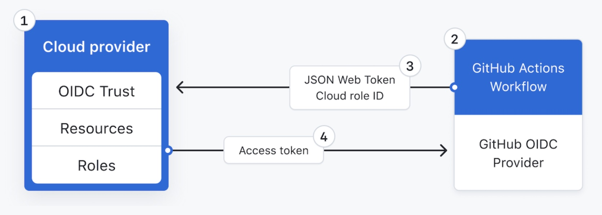

## OIDC setup provider

 <br>

### 1. We need to create Identity providers

- click on the IAM --> Identity providers --> Add Provider
- select OpenID Connect
- Provider URL: https://token.actions.githubusercontent.com
- Click on Get thumbprint
- Audience: sts.amazonaws.com
- Add tags
- Click on Add provider


### 2. Create OIDC Role for each repo
- Roles --> Create Role --> click on Web Identity
- select Identity provider --> token.actions.githubusercontent.com
- Select Audience: sts.amazonaws.com
- select permissions
- Enter role name: <repo>-oidc-role
- Add tags
- Create a role

### 3. After role created go to the roles
- click on the Roles --> select the created role -->  click on Trust Relationships
- you need to modify the conditions. . please check trustpolicy.json for the sample

### 4. sample trust policy json
- Example: repo:DevOpsAirflow/devsecops-class-ec2-cicd:pull_request
- Example: repo:DevOpsAirflow/devsecops-class-ec2-cicd:ref:refs/heads/main (branch name: developer-apply, destroy, development, staging, main)


```
{
    "Version": "2012-10-17",
    "Statement": [
        {
            "Effect": "Allow",
            "Principal": {
                "Federated": "arn:aws:iam::<account-number>:oidc-provider/token.actions.githubusercontent.com"
            },
            "Action": "sts:AssumeRoleWithWebIdentity",
            "Condition": {
                "StringEquals": {
                    "token.actions.githubusercontent.com:aud": "sts.amazonaws.com",
                    "token.actions.githubusercontent.com:sub": [
                        "repo:<repo-name>:pull_request",
                        "repo:<repo-name>:ref:refs/heads/<branch-name>"
                    ]
                }
            }
        }
    ]
}
```


That's it you established STS connectivity from GitHub to AWS Account

### Reference
- https://docs.github.com/en/actions/deployment/security-hardening-your-deployments/configuring-openid-connect-in-amazon-web-services
- https://docs.github.com/en/actions/deployment/security-hardening-your-deployments/about-security-hardening-with-openid-connect